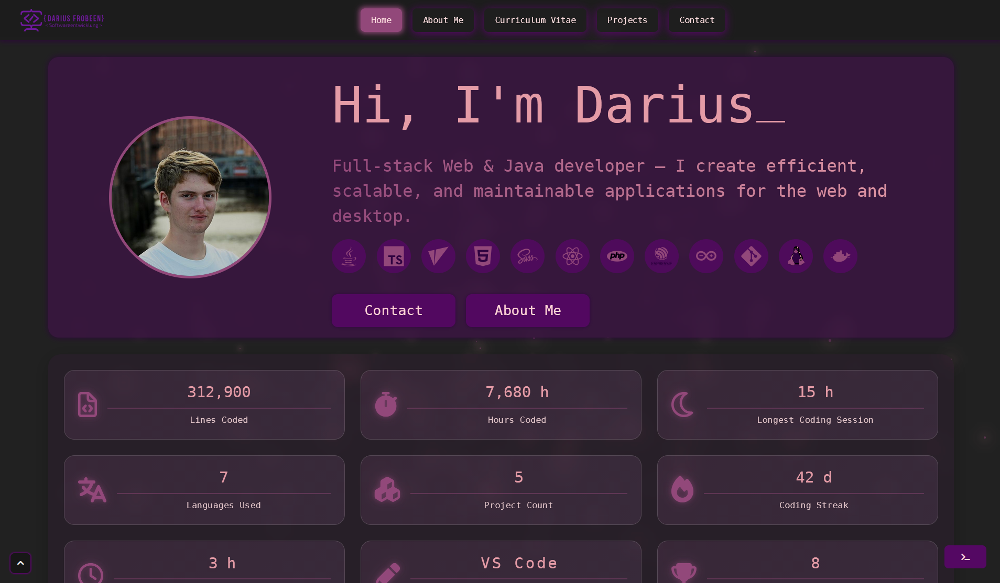
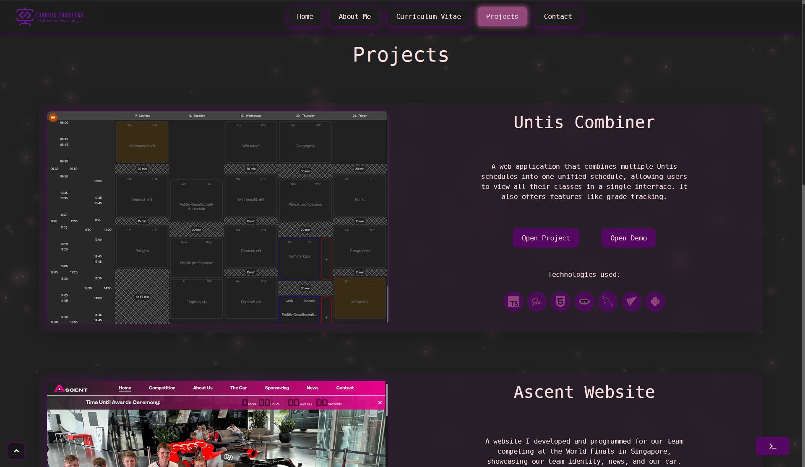
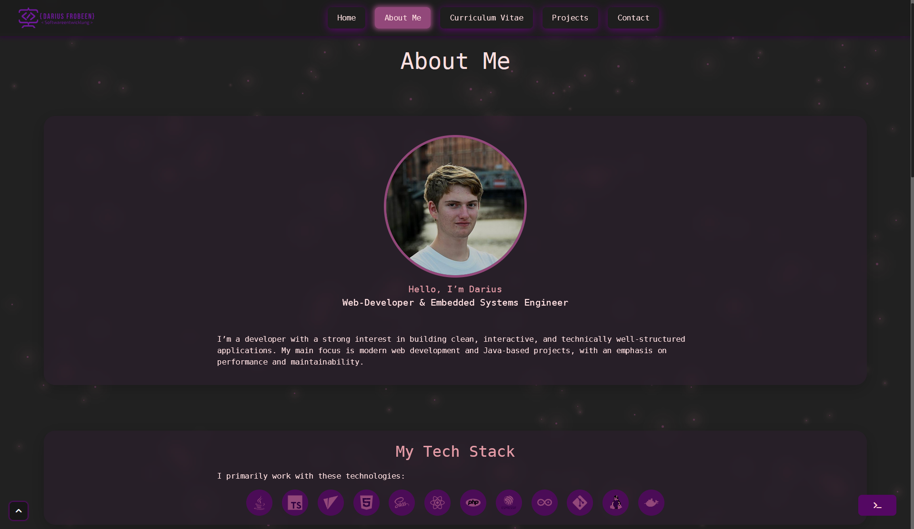
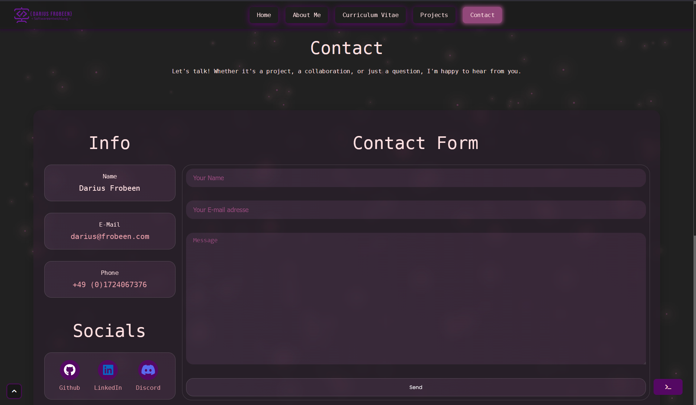
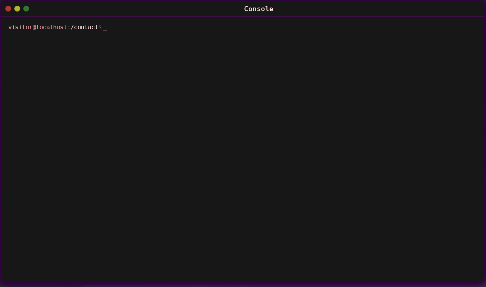

# Portfolio

**React-based Developer Portfolio**
This repository contains my personal portfolio website built with React. It showcases my skills, projects, experience, and professional background in a clean and modern interface.

## Demo

Visit the live version at:
**[https://darius.frobeen.com](https://darius.frobeen.com)**

## Screenshots
```





```

## Features

This portfolio includes:

* Fully responsive UI built with React
* Modern layout for *About*, *Skills*, *Projects*, and *Contact* sections
* Smooth navigation and animated transitions
* Easy customization of content and styles
* Language Support *Englisch* / *German*

## Built With

This project is built using the following core technologies:

* **React** (frontend framework) ([GitHub][1])
* **Vite** (tooling)
* **SCSS**
* **self-hosted deployment using Nginx on a Raspberry Pi** (deployment platform, if deployed)

## License

The source code is licensed under the **MIT License**.
**All personal content, text, images, and branding are © Darius and may not be reused without permission.**